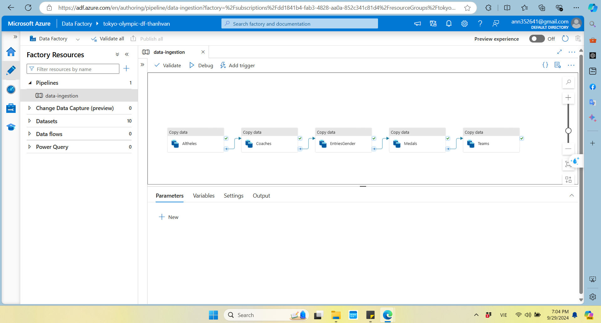

# Olympic-data-analytics-project

## Table of Contents
## Introduction
The Tokyo Olympic Data Analysis project on Azure is a comprehensive solution designed to analyze and visualize Olympic Games data utilizing a range of Azure services. The project demonstrates how to harness the power of cloud computing and Azure's data capabilities to extract valuable insights from historical Olympic datasets. By integrating Azure Databricks, Azure Data Factory, and other Azure resources, this solution offers a scalable and efficient approach to processing, transforming, and analyzing large volumes of Olympic data.
## Architecture

## Technology Used
- Azure Storage  
- Azure SQL Database
- Azure Data Factory
- Azure Databricks
- Azure Synapse Analytics
## Data Ingestion

## Data Processing

The data processing stage involves cleaning and transforming raw Olympic data into a structured format suitable for analysis. This step takes advantage of Azure Databricks' distributed computing capabilities for efficient processing.
## Conclusion
The Olympic Data Analysis on Azure project demonstrates how to leverage Azure services for processing, analyzing, and visualizing large-scale data. By following the setup and guides provided in this repository, you can adapt the project to other domains and expand its functionalities

