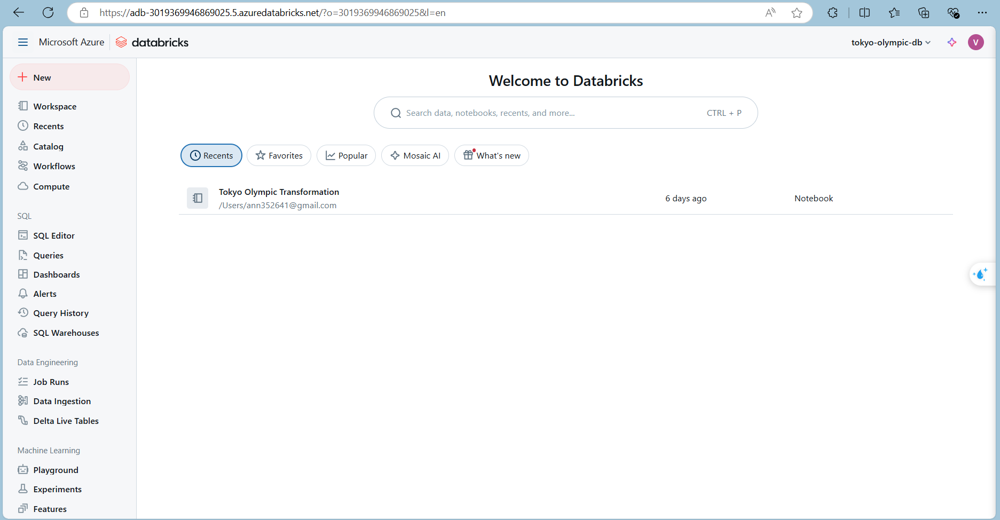

# Olympic-data-analytics-project

## Table of Contents
- [Introduction](#introduction)
- [Architecture](#architecture)
- [Technologies Used](#technologies-used)
- [Data Ingestion](#data-ingestion)
- [Data Processing](#data-processing)
- [Conclusion](#conclusion)
## Introduction
The Tokyo Olympic Data Analysis project on Azure is a comprehensive solution designed to analyze and visualize Olympic Games data utilizing a range of Azure services. The project demonstrates how to harness the power of cloud computing and Azure's data capabilities to extract valuable insights from historical Olympic datasets. By integrating Azure Databricks, Azure Data Factory, and other Azure resources, this solution offers a scalable and efficient approach to processing, transforming, and analyzing large volumes of Olympic data.
## Architecture

The architecture of the project consists of the following components:
- Azure Databricks: Used for data processing, transformation, and analysis. It provides a collaborative and interactive environment for running Spark-based jobs.
- Azure Data Factory: Manages and orchestrates the data workflow. It is responsible for data ingestion from various sources, data transformation, and scheduling of jobs.
- Azure Storage: Serves as the data lake for storing raw and processed data. It can also host intermediate results generated during the analysis.
- Azure SQL Database: Stores the cleaned and transformed data, making it accessible for visualization and reporting.
- Power BI: Connects to the Azure SQL Database to create interactive and visually appealing dashboards for data exploration.
## Technology Used
- Azure Storage  
- Azure SQL Database
- Azure Data Factory
- Azure Databricks
- Azure Synapse Analytics

## Data Ingestion

## Data Processing

The data processing stage involves cleaning and transforming raw Olympic data into a structured format suitable for analysis. This step takes advantage of Azure Databricks' distributed computing capabilities for efficient processing.
## Conclusion
The Olympic Data Analysis on Azure project demonstrates how to leverage Azure services for processing, analyzing, and visualizing large-scale data. By following the setup and guides provided in this repository, you can adapt the project to other domains and expand its functionalities

